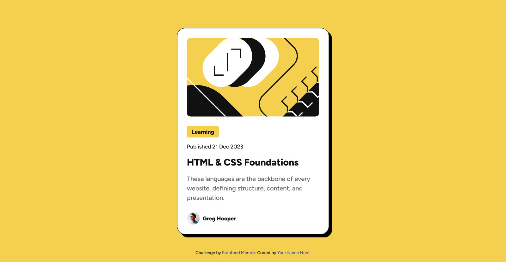

# Frontend Mentor - Blog preview card solution

This is a solution to the [Blog preview card challenge on Frontend Mentor](https://www.frontendmentor.io/challenges/blog-preview-card-ckPaj01IcS). Frontend Mentor challenges help you improve your coding skills by building realistic projects. 

## Table of contents

- [Frontend Mentor - Blog preview card solution](#frontend-mentor---blog-preview-card-solution)
  - [Table of contents](#table-of-contents)
  - [Overview](#overview)
    - [The challenge](#the-challenge)
    - [Screenshot](#screenshot)
    - [Links](#links)
  - [My process](#my-process)
    - [Built with](#built-with)
    - [What I learned](#what-i-learned)
    - [Continued development](#continued-development)
  - [Author](#author)

## Overview

### The challenge

### Screenshot



### Links

- Solution URL: [Repository URL](https://github.com/Donsmatt/fm_blog_preview_card)
- Live Site URL: [Blog preview card component live site](https://fm-blog-preview-card-cyan.vercel.app/)

## My process

### Built with

- Semantic HTML5 markup
- CSS custom properties
- CSS Variables
- Flexbox
- CSS Grid
- CSS variable fonts

### What I learned

Another very good project.  Helped me recall my knowlodge on box shadows and i was most impressed with my use of CSS variable fonts for the first time. I look forward to more enlightening projects moving forward.

```css
@font-face {
  font-family: "Figtree";
  src: url("../assets/fonts/Figtree-VariableFont_wght.ttf");
  font-display: swap;
}

```

### Continued development

I would want to improve on my css code optimization and naming conventions.

## Author

- Frontend Mentor - [@Donsmatt](https://www.frontendmentor.io/profile/Donsmatt)
- Twitter - [@Donsmatt](https://x.com/CAdaigho)
- Github = [@Donsmatt](https://github.com/Donsmatt)
